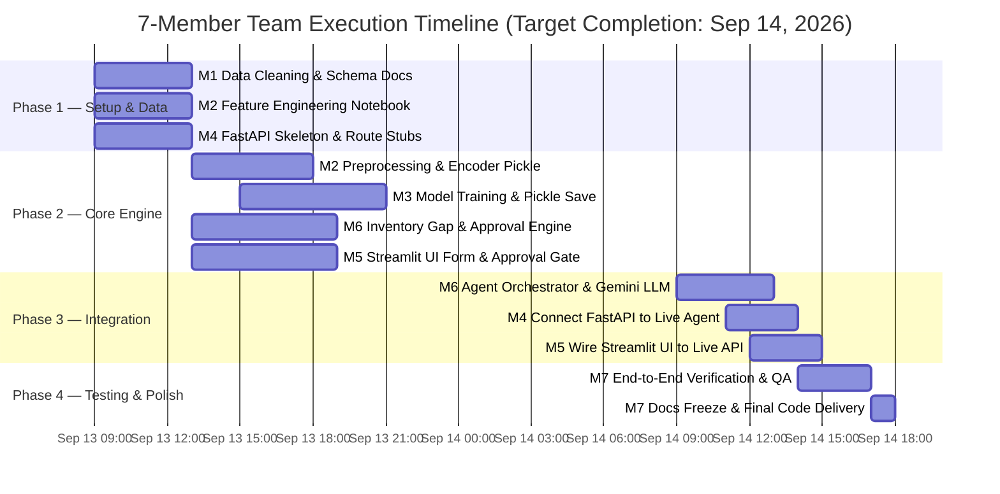

# Demand Forecasting & Inventory Optimization Agent

[](https://www.python.org/downloads/)
[](https://fastapi.tiangolo.com/)
[](https://streamlit.io/)
[](https://xgboost.readthedocs.io/)
[](https://deepmind.google/technologies/gemini/)

An end-to-end, production-ready **Demand Forecasting and Inventory Optimization Solution** built for GITAM Use Case #4. The system predicts retail demand across store-product combinations, identifies stockout and overstock risks, provides LLM-driven business rationale (via Google Gemini), and executes a **Human-in-the-Loop Approval Workflow** before triggering replenishment actions.

---

## 📌 Use Case Overview (GITAM Shortlist #4)

| Attribute | Details |
|---|---|
| **Use Case Name** | Demand Forecasting and Inventory Optimization Agent |
| **Problem Statement** | Retailers face frequent stockouts and excess inventory costs due to inaccurate demand planning across diverse stores, products, regions, seasons, promotional campaigns, pricing, and external factors. |
| **Objective** | Build a forecasting and inventory optimization agent that predicts demand, identifies stockout risk, generates intelligent recommendations, and **recommends replenishment actions for human manager approval**. |
| **Solution Type** | Time Series Forecasting / Optimization / Agentic AI |
| **Data Source** | [Kaggle Retail Store Inventory & Demand Forecasting Dataset](https://www.kaggle.com/datasets/atomicd/retail-store-inventory-and-demand-forecasting) |
| **Key Categories** | 5 Categories: `Groceries`, `Clothing`, `Electronics`, `Furniture`, `Toys` |

---

## ✨ Key Features

- **🎯 Machine Learning Demand Forecasting**: Multi-factor ML regression model (XGBoost / Gradient Boosting) trained on historical sales, calendar trends, pricing, discounts, promotions, and environmental signals.
- **📊 Real-time Inventory Gap Analysis**: Dynamically computes demand vs. current inventory level to classify status into `Shortage`, `Sufficient`, or `Overstock` with safety stock buffers (20%).
- **🧠 Agentic AI Reasoning (Gemini 1.5 Flash)**: Translates numeric predictions and inventory metrics into executive-level, natural-language recommendations explaining *why* action is needed.
- **🛡️ Human-in-the-Loop Approval Gate**: Mandatory manager review screen allowing supervisors to **Approve**, **Modify** (custom quantity), or **Reject** replenishment orders with custom comments.
- **📝 Audit Trail & History Log**: Persists all forecast requests and human decisions to a structured log (`logs/approval_log.json`) with searchable history in the Streamlit UI.
- **⚡ Modular FastAPI & Streamlit Architecture**: Clean separation between backend services, prediction models, LLM agents, and frontend interactive management dashboards.

---

## 🏗️ System Architecture

```
┌─────────────────┐       ┌──────────────────┐       ┌────────────────────┐
│   Streamlit UI  │       │  FastAPI Backend │       │   ML Model Layer   │
│ (Form + Results)│──────▶│   (main.py)      │──────▶│   forecast_tool()  │
│  + Approval UI  │       │                  │       │ (best_model.pkl)   │
└────────┬────────┘       └────────┬─────────┘       └──────────┬─────────┘
         │                         │                            │
         │                         ▼                            ▼
         │                ┌──────────────────┐        ┌──────────────────┐
         │                │   Agent Layer    │◀───────│   Demand Value   │
         │                │  (Gemini 1.5)    │        └──────────────────┘
         │                └────────┬─────────┘
         │                         │
         │                         ▼
         │                ┌──────────────────┐
         │                │ Inventory Gap    │
         │                │ & Status Rules   │
         │                └────────┬─────────┘
         │                         │
         │                         ▼
         │                ┌───────────────────────────────────┐
         │                │ Suggested Replenishment Action    │
         │                └────────┬──────────────────────────┘
         │                         │
         ◀─────────────────────────┘
         │
         ▼
┌─────────────────────────────────────────────────────────────┐
│                 HUMAN APPROVAL GATE (MANDATORY)             │
│                                                             │
│  Manager views:                                             │
│  • Predicted demand vs. inventory level                     │
│  • Shortage / Overstock status & urgency                    │
│  • LLM reasoning & tool call trace                          │
│  • Suggested reorder quantity                               │
│  Manager actions:                                           │
│  ✅ APPROVE   — Accept suggested order as-is                 │
│  ✏️ MODIFY    — Adjust order quantity                         │
│  ❌ REJECT    — Dismiss recommendation with comments          │
└──────────────────────────────┬──────────────────────────────┘
                               │
                               ▼
┌─────────────────────────────────────────────────────────────┐
│                 AUDIT LOG (`logs/approval_log.json`)        │
└─────────────────────────────────────────────────────────────┘
```

---

## 📂 Repository Structure

```text
Demand-Forecasting-Inventory-Agent/
├── data/
│   └── sales_data.csv                 # Raw retail dataset (Jan 2022 – Jan 2024)
├── models/
│   ├── best_model.pkl                 # Serialized XGBoost / ML forecast model
│   ├── encoders.pkl                   # Categorical encoders (Category, Region, etc.)
│   └── README.md                      # Model card & feature order documentation
├── notebooks/
│   ├── 01_data_understanding.ipynb    # Data quality, schema, demand-inventory gap discovery
│   ├── 02_eda_problem_discovery.ipynb # Business drivers (Promo, Weather, Season, Epidemic)
│   ├── 03_demand_analysis.ipynb       # Time trends & feature engineering contract
│   ├── 04_forecasting.ipynb           # Model training, comparison & selection
│   └── 05_inventory_analysis.ipynb    # Inventory rules & stockout threshold validation
├── backend/
│   ├── __init__.py
│   ├── main.py                        # FastAPI endpoints & route definitions
│   ├── data_preprocessing.py          # Feature transformation pipeline (preprocess_input)
│   ├── forecasting.py                 # Forecast tool loading best_model.pkl
│   ├── inventory.py                   # Gap calculation, stock status, reorder quantity
│   ├── agent.py                       # Orchestrator & Gemini LLM reasoning module
│   ├── approval.py                    # Human decision recorder & audit trail manager
│   └── config.py                      # Environment variables, constants, file paths
├── frontend/
│   └── app.py                         # Streamlit interactive application & approval UI
├── logs/
│   └── approval_log.json              # Persistent audit log of all human decisions
├── outputs/
│   ├── figures/                       # Saved exploratory charts
│   └── reports/                       # Data dictionary & model evaluation reports
├── tests/
│   ├── test_data_preprocessing.py
│   ├── test_forecasting.py
│   ├── test_inventory.py
│   ├── test_agent.py
│   ├── test_approval.py
│   └── test_api.py
├── .env.example                       # Example environment file (GEMINI_API_KEY)
├── .gitignore                         # Version control exclusions
├── ARCHITECTURE.md                    # Deep-dive architectural design specification
├── GIT_WORKFLOW.md                    # Team collaboration rules & ownership map
├── README.md                          # Project documentation (this file)
└── requirements.txt                   # Python dependency requirements
```

---

## 🔬 Exploratory Data Analysis & Notebook Workflow

The core business logic originates directly from 5 analytical Jupyter notebooks:

1. **`01_data_understanding.ipynb`**: Analyzed dataset integrity (76,000 observations). Discovered core stockout signal where `Demand > Inventory Level` (13.68% shortage rate across stores) and `Potential_Lost_Sales`.
2. **`02_eda_problem_discovery.ipynb`**: Uncovered key demand drivers across Store ID, Product ID, Category, Region, Weather Condition, Seasonality, Promotion campaigns, and Epidemic flags.
3. **`03_demand_analysis.ipynb`**: Formalized feature engineering. Extracted calendar features (`Year`, `Month`, `Day`, `DayOfWeek`, `WeekOfYear`, `Quarter`, `IsWeekend`) and established the categorical encoding contract.
4. **`04_forecasting.ipynb`**: Benchmarked Linear Regression, Random Forest, and XGBoost models using chronologically split validation. Serialized the top performer to `models/best_model.pkl`.
5. **`05_inventory_analysis.ipynb`**: Validated safety stock formulas and reorder rules used in `backend/inventory.py`.

---

## 📊 Dataset Schema & Input Features

### Raw Categoricals & Variables

| Field | Type | Options / Range | Description |
|---|---|---|---|
| **Store ID** | Categorical | `S001`, `S002`, `S003`, `S004`, `S005` | Store location identifier |
| **Product ID** | Categorical | `P0001` – `P0020` | Stock keeping unit (SKU) |
| **Category** | Categorical | `Groceries`, `Clothing`, `Electronics`, `Furniture`, `Toys` | Product classification (5 categories) |
| **Region** | Categorical | `North`, `South`, `East`, `West` | Geographical store region |
| **Weather Condition** | Categorical | `Sunny`, `Cloudy`, `Rainy`, `Snowy` | Local weather state |
| **Seasonality** | Categorical | `Winter`, `Spring`, `Summer`, `Autumn` | Current seasonal period |
| **Promotion** | Flag | `0` (No), `1` (Yes) | Active promotional campaign |
| **Epidemic** | Flag | `0` (No), `1` (Yes) | Local outbreak/emergency flag |
| **Price** | Float | Continuous | Selling price per unit |
| **Discount** | Float | `0.0` – `25.0` | Discount percentage applied |
| **Competitor Pricing** | Float | Continuous | External market pricing benchmark |
| **Inventory Level** | Integer | Continuous | Current stock on hand at store |

---

## ⚖️ Inventory Optimization Rules

The inventory engine (`backend/inventory.py`) applies deterministic rules validated in `notebooks/05_inventory_analysis.ipynb`:

$$\text{Gap} = \text{Inventory Level} - \text{Predicted Demand}$$

- **`Shortage`** ($\text{Gap} < 0$): Inventory is below predicted demand.
  - **Reorder Quantity**: $\text{abs}(\text{Gap}) \times 1.2$ (Orders shortage amount plus a **20% safety stock buffer**).
  - **Urgency**: `Critical` if $\text{Gap} < -50$, else `Moderate`.
  - **Human Approval**: `requires_approval = True`.
- **`Sufficient`** ($0 \le \text{Gap} \le \text{Predicted Demand} \times 0.20$): Inventory covers demand adequately.
  - **Reorder Quantity**: $0$.
  - **Urgency**: `None`.
  - **Human Approval**: `requires_approval = False`.
- **`Overstock`** ($\text{Gap} > \text{Predicted Demand} \times 0.20$): Excess inventory exceeds demand by more than 20%.
  - **Reorder Quantity**: $0$.
  - **Urgency**: `None` (Recommendation suggests clearance or hold).
  - **Human Approval**: `requires_approval = False`.

---

## 🔌 API Endpoints (FastAPI)

The FastAPI server provides the following structured endpoints:

| Method | Endpoint | Description |
|---|---|---|
| `GET` | `/api/health` | Service health status & model availability check |
| `GET` | `/api/options` | Valid categorical dropdown values for UI population |
| `POST` | `/api/forecast` | Submits store parameters, predicts demand, calculates inventory gap, and returns Gemini recommendation |
| `POST` | `/api/approve` | Records a human manager decision (`approved`, `modified`, `rejected`) into `approval_log.json` |
| `GET` | `/api/approvals` | Fetches historical decision logs with optional filters |

---

## 🛠️ Setup & Installation

### Prerequisites

- Python 3.10+
- Git

### 1. Clone Repository & Setup Environment

```bash
git clone https://github.com/Saketh1929/Demand-Forecasting-And-Inventory-Optimization.git
cd Demand-Forecasting-And-Inventory-Optimization

# Create virtual environment
python -m venv .venv

# Activate environment (macOS/Linux)
source .venv/bin/activate

# Activate environment (Windows PowerShell)
# .venv\Scripts\Activate.ps1
```

### 2. Install Dependencies

```bash
pip install -r requirements.txt
```

### 3. Configure Environment Variables

Copy `.env.example` to `.env` and add your Gemini API Key:

```bash
cp .env.example .env
```

In `.env`:
```ini
GEMINI_API_KEY=your_google_gemini_api_key_here
PORT=8000
HOST=0.0.0.0
```

---

## 🚀 Running the Application

### Option A: Run Backend & Frontend Separately

**1. Start FastAPI Backend:**
```bash
uvicorn backend.main:app --reload --port 8000
```
*API interactive documentation will be available at `http://localhost:8000/docs`.*

**2. Start Streamlit Frontend (in a new terminal):**
```bash
streamlit run frontend/app.py
```
*UI will open automatically at `http://localhost:8501`.*

---

## 🧪 Testing & Verification

Run the comprehensive unit and integration test suite:

```bash
# Run all tests with verbose output
pytest tests/ -v

# Run specific test modules
pytest tests/test_data_preprocessing.py -v
pytest tests/test_forecasting.py -v
pytest tests/test_inventory.py -v
pytest tests/test_agent.py -v
pytest tests/test_approval.py -v
pytest tests/test_api.py -v
```

---

## 📅 7-Member Team Execution Plan & Timeline (Completion: On or Before Sep 14)

To ensure zero-conflict collaboration and guarantee complete delivery **on or before September 14, 2026**, work is divided into 7 distinct module owners with isolated file ownership and a strict 4-phase execution schedule.

---

### 1. Team Ownership Map & Deliverables

| Member | Focus Area | Files You CAN Touch | Key Deliverables |
|---|---|---|---|
| **Member 1** | **Data Understanding & EDA** | `data/sales_data.csv`<br>`notebooks/01_data_understanding.ipynb`<br>`notebooks/02_eda_problem_discovery.ipynb`<br>`outputs/reports/data_dictionary.md` | • Validated raw CSV dataset (76,000 rows)<br>• Category verification (Groceries, Clothing, Electronics, Furniture, Toys)<br>• Data dictionary & EDA charts |
| **Member 2** | **Preprocessing Pipeline** | `backend/data_preprocessing.py`<br>`notebooks/03_demand_analysis.ipynb`<br>`models/encoders.pkl`<br>`tests/test_data_preprocessing.py` | • `preprocess_input(row: dict) -> np.ndarray`<br>• Encoders serialized to `models/encoders.pkl`<br>• Calendar feature pipeline (`Year`, `Month`, `DayOfWeek`, etc.) |
| **Member 3** | **ML Model Training** | `notebooks/04_forecasting.ipynb`<br>`backend/forecasting.py`<br>`models/best_model.pkl`<br>`models/README.md`<br>`outputs/reports/model_evaluation.md`<br>`tests/test_forecasting.py` | • Trained & tuned XGBoost model serialized to `models/best_model.pkl`<br>• `forecast_tool()` function<br>• Model evaluation report (RMSE, MAE, R²) |
| **Member 4** | **Backend API Service** | `backend/main.py`<br>`backend/config.py`<br>`backend/__init__.py`<br>`requirements.txt`<br>`.env.example`<br>`tests/test_api.py` | • FastAPI backend (`POST /api/forecast`, `POST /api/approve`, `GET /api/approvals`, `GET /api/health`, `GET /api/options`) |
| **Member 5** | **Frontend Streamlit UI** | `frontend/app.py` | • Interactive Streamlit Dashboard<br>• Business input form<br>• Result display cards & Human Approval UI<br>• Historical decision log view |
| **Member 6** | **Agent & Approval Engine** | `backend/agent.py`<br>`backend/inventory.py`<br>`backend/approval.py`<br>`notebooks/05_inventory_analysis.ipynb`<br>`logs/approval_log.json`<br>`tests/test_inventory.py`<br>`tests/test_agent.py`<br>`tests/test_approval.py` | • `evaluate_inventory()` gap analysis & 20% safety stock logic<br>• `run_agent()` orchestrator + Gemini 1.5 LLM prompt<br>• Approval recorder & audit logger (`approval_log.json`) |
| **Member 7** | **Integration, QA & Docs** | `tests/`<br>`.gitignore`<br>`README.md`<br>`ARCHITECTURE.md` | • End-to-end integration tests<br>• Automated verification suite<br>• System architecture & final documentation |

---

### 2. Timeline & Gantt Schedule (Sep 13 – Sep 14)



---

### 3. Execution Schedule Breakdown

#### 📍 Phase 1: Data Validation & Foundation (Sep 13 Morning: 09:00 – 13:00)
- **M1**: Clean `data/sales_data.csv`, document dataset schema, confirm 5 categories (including `Toys`), publish `data_dictionary.md`.
- **M2**: Finalize temporal and categorical feature specifications in `03_demand_analysis.ipynb`.
- **M4**: Setup FastAPI app skeleton in `backend/main.py` with Pydantic request models and health check routes.

#### 📍 Phase 2: Preprocessing, Modeling & Component Logic (Sep 13 Afternoon: 13:00 – 21:00)
- **M2**: Build `backend/data_preprocessing.py` (`preprocess_input`) and save `models/encoders.pkl`.
- **M3**: Train XGBoost regressor, validate performance (RMSE/MAE/R²), serialize `models/best_model.pkl`, implement `backend/forecasting.py`.
- **M6**: Build `backend/inventory.py` (20% safety buffer rules) and `backend/approval.py` audit trail handler.
- **M5**: Construct Streamlit input forms and results layout in `frontend/app.py`.

#### 📍 Phase 3: Agent Orchestration & API Integration (Sep 14 Morning: 09:00 – 14:00)
- **M6**: Assemble `backend/agent.py` combining preprocessing, model forecasting, inventory evaluation, and Gemini 1.5 Flash LLM reasoning.
- **M4**: Wire `POST /api/forecast` and `POST /api/approve` endpoints in FastAPI to live agent and approval services.
- **M5**: Connect Streamlit frontend to FastAPI endpoints, implementing interactive **Approve / Modify / Reject / Comment** actions and audit history table.

#### 📍 Phase 4: Integration Testing & Final Delivery (Sep 14 Afternoon: 14:00 – 18:00)
- **M7**: Execute automated unit & E2E tests (`pytest tests/ -v`).
- **M7**: Validate full human-in-the-loop approval workflow and audit log persistence.
- **Team**: Final pull request merges into `main` branch prior to **September 14, 18:00 deadline**.

---

### 4. Zero-Conflict Merge Sequence

To eliminate Git merge conflicts, feature branches must be merged into `main` sequentially:

```text
1st Merge ──▶ Member 1 (data/ & notebooks/01, 02)        [No dependencies]
2nd Merge ──▶ Member 2 (backend/data_preprocessing.py)   [Depends on M1 data]
3rd Merge ──▶ Member 3 (models/best_model.pkl)           [Depends on M2 encoders]
4th Merge ──▶ Member 6 (backend/inventory.py & agent.py)  [Depends on M2 & M3]
5th Merge ──▶ Member 4 (backend/main.py FastAPI)         [Depends on M6 agent]
6th Merge ──▶ Member 5 (frontend/app.py Streamlit)       [Depends on M4 API]
7th Merge ──▶ Member 7 (tests/ & Final Documentation)    [Depends on all]
```

---

### 5. Final Delivery Checklist (Target: Sep 14, 18:00)

- [ ] All 7 feature branches merged into `main` without conflicts.
- [ ] `models/best_model.pkl` and `models/encoders.pkl` present and validated.
- [ ] Backend starts cleanly: `uvicorn backend.main:app --reload --port 8000`.
- [ ] Frontend starts cleanly: `streamlit run frontend/app.py`.
- [ ] Forecast request generates valid demand prediction & LLM recommendation.
- [ ] Human Approval Gate functions correctly (**Approve / Modify / Reject**).
- [ ] `logs/approval_log.json` accurately records manager decisions and timestamped comments.
- [ ] Full test suite passes: `pytest tests/ -v`.

---

## 📜 License

This project is developed for educational and research purposes as part of the GITAM Capstone Shortlisted Use Cases.

